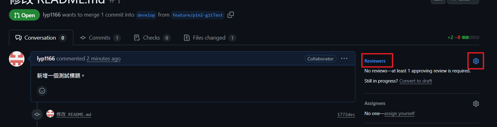

# GitHub flow 協作操作流程手冊（main / develop 分支）

請先基本閱讀過 [Git & GitHub 教學手冊 建議閱讀的教學](./Git&GitHub%20教學手冊_建議閱讀的教學.md) 了解相關概念。

以下為練習 repo：

- 正式 repo

  https://github.com/YPINPIN/web-layout-training-git-test

- preview repo (只用來放 develop 的 Github pages)

  https://github.com/YPINPIN/web-layout-training-git-test-preview

補充教學：

[Git commit 忘記切分支補救方式](https://medium.com/prochini/%E6%80%A5-git-commit-%E5%BF%98%E8%A8%98%E5%88%87%E5%88%86%E6%94%AF-727aba80ba85)

## 1. 專案複製到本地

```bash
git clone <遠端專案網址>
```

> 從遠端複製專案到本地，建立完整的專案副本。


```bash
cd <專案資料夾>
```

> 進入剛複製的專案資料夾，準備開始操作。


```bash
npm install
npm run dev
```

> 首先執行 npm 確認專案執行沒問題。

## 2. 從最新 develop 切出功能分支 (開發由此開始)

```bash
git checkout develop
```

> 切換到 develop 分支。


```bash
git pull origin develop
```

> 從遠端更新本地的 develop 分支，確保本地是最新狀態。


```bash
git checkout -b feature/<你的名稱-功能名稱>
```

> 從 develop 建立一個新的功能分支並切換到新分支，例如：feature/pin-login。


## 3. 本地開發與提交

```bash
git add .
```

> 將修改過的檔案加入暫存區，準備提交。

```bash
git commit -m "清楚描述本次改動"
```

> 建立一個新的 commit，需撰寫簡潔明瞭的訊息，方便團隊理解。


## 4. 發 PR 前同步功能分支至最新 develop（必做）

```bash
git fetch origin
```

> 從遠端獲取所有最新更新（不會自動合併當前分支 ）。

```bash
git rebase origin/develop
```

> 將當前的功能分支更新到 `develop` 的最新版本之後，保持歷史紀錄清晰。補充教學：[另一種合併方式（使用 rebase）](https://gitbook.tw/chapters/branch/merge-with-rebase)。


- 若發生衝突：

  

  根據提示調整修改檔案並存檔：

  

  

  `git add` 解決完的檔案，繼續 `rebase`，直到沒有遇到衝突完成：

  ```bash
  git add <衝突解決檔案>
  git rebase --continue
  ```

  如果 Terminal 跳出訊息，Terminal 就直接輸入 `:wq` 存檔退出：

  

  

- 若沒有衝突

  ```bash
  git push origin feature/<功能名稱> --force-with-lease
  ```

  > 強制推送更新後的分支到遠端，`--force-with-lease` 可以避免誤覆蓋他人的更改。

  

## 5. 建立 Pull Request（PR）

- 到 GitHub 進入專案頁面，點擊上方標籤「Pull requests」，點擊右側的「New pull request」按鈕。


- 在比較分支（compare）選擇你的功能分支，如 `feature/...`；在基底分支（base）選擇目標分支 `develop`。

- GitHub 會自動顯示兩分支間的差異，請確認修改內容無誤，點擊「Create pull request」按鈕。


- 在表單中，填寫 PR 標題，簡要並明確，並在描述欄詳細說明本次變更內容、功能，完成後點擊「Create pull request」。


- 接著可以指派 Reviewer（審查員）。




## 6. PR 審查與合併

- Code Review

  - 當有人發起 Pull Request（PR）並指派你為 Reviewer（審查員），GitHub 會透過 Email、GitHub 通知中心或其他整合工具（如 Slack）通知你。

  - 點擊通知中 PR 連結，可以進入該 PR 的 GitHub 頁面，或是直接進入 PR 頁面，了解本次改動目的及範圍。

    

  - 在 PR 頁面可以點擊「Commits」標籤頁查看本次提交的所有 commit。

    

  - 除了可以在「Conversation」標籤頁對整體 PR 發表一般評論，也可以點擊「Files changed」標籤頁，查看本次修改的檔案，也可以點擊特定行旁邊的加號 (+) 號，新增行內評論（Inline Comment），提出具體問題或建議。留言後可點「Start a review」開始一次審查，或「Add single comment」直接提交單次評論。

    

    

  - 在完成所有評論和建議後，可以選擇「Conversation」標籤頁上方「Add your review」進入「Files changed」標籤，或是直接進入「Files changed」標籤頁點擊右上方「Review changes」。

    

    

  - 接著選擇對應審查結果點擊「Submit review」發送，基本上沒問題皆為選擇 Approve（批准）。

    - Comment（單純發表意見）：給予建議或討論，無合併決策。

    - Approve（批准）：表示同意合併。

    - Request changes（要求修改）：表示發現需要修正的問題，要求 PR 發起人修改，必須撰寫說明，指出需要改進的具體地方。

    

- PR 發起人在收到審查意見後，可在本地修改代碼，重複提交（git push）到該功能分支，GitHub 會自動追加更新到同一 PR。Reviewer（審查員）會收到通知並重新審查。

- 若無衝突可直接合併到 `develop`

  - 當 PR 通過審查且無衝突，Reviewer 審查員（或有權限者）會點擊「Merge pull request」按鈕。

  - 可選擇 Create a merge commit（保留歷史的 merge commit）。

  - 完成合併後，PR 自動關閉。

  

  

  

  - 可以看到 `develop` 分支已 merge 成功新功能。

  

  

- 若有衝突

  - 如果 PR 和目標分支間存在合併衝突，GitHub 會顯示「This branch has conflicts that must be resolved」提示。

  

  - 發 PR 的人需依照 [第 4 步](#4-發-pr-前同步功能分支至最新-develop必做) 操作，解決衝突並更新分支，接著需要重新審查。

## 7. 合併完成後刪除分支 (建議執行，由 PR 發起人操作)

```bash
git checkout develop
git pull origin develop
```

> 不可以刪除當前在的分支，因此必須先切換到 `develop` 分支並更新合併狀態，再進行刪除操作。

```bash
git branch -d feature/<功能名稱>
```

> 刪除本地已合併的功能分支。


```bash
git push origin --delete feature/<功能名稱>
```

> 刪除遠端已合併的功能分支，保持倉庫乾淨。


現在 Github 上也不會有這個分支了。


## 🔄 8. 新功能開發循環

> 新功能都應從最新的 `develop` 切分支 → 回到 [第 2 步](#2-從最新-develop-切出功能分支-開發由此開始) 開始操作。

---

## 🚀 9. 合併 develop 版本到 main（由一人執行，使用 Pull Request）

當 `develop` 分支 Deploy 到預覽版 GitHub Pages ( 方式請看 [第 10 步](#10-在-pr-合併到-develop-和-main-之後會自動觸發-github-action-來-deploy-github-pages) ) 上測試確認功能無誤後可以合併版本到 `main` 分支。

```bash
git checkout develop
```

> 切換到 `develop` 分支。

```bash
git pull origin develop
```

> 更新本地 `develop` 分支至最新。

```bash
git checkout -b release/main-YYYYMMDD-v1
```

> 建立針對 `main` 分支的新發佈分支，這個步驟可讓你在獨立的發佈分支上準備 PR，避免直接在 `develop` 分支操作，也能清楚標示本次發佈版本。


```bash
git push origin release/main-YYYYMMDD-v1
```

> 推送發佈分支到遠端


- 向 main 分支建立 Pull Request（PR）

  可以參考 [第 5 步](#5-建立-pull-requestpr)。

  - 到 GitHub 進入專案頁面，點擊上方標籤「Pull requests」，點擊右側的「New pull request」按鈕。

  - 在比較分支（compare）選擇要發佈的分支，如 `release/main-YYYYMMDD-v1`；在基底分支（base）選擇目標分支 `main`。

  - GitHub 會自動顯示兩分支間的差異，請確認修改內容無誤，點擊「Create pull request」按鈕。

  - 在表單中，填寫 PR 標題，簡要並明確，並在描述欄詳細說明本次變更內容、功能。

  - 指派 Reviewer（審查員），完成後點擊「Create pull request」。

- PR 通過審查後，將 PR 合併到 `main` 分支

  可以參考 [第 6 步](#6-pr-審查與合併)。

- PR 合併完成後刪除發佈分支（可省略）

  ```bash
  git checkout main
  git pull origin
  git branch -d release/main-YYYYMMDD-v1
  git push origin --delete release/main-YYYYMMDD-v1
  ```

# 10. 在 PR 合併到 develop 和 main 之後會自動觸發 Github Action 來 Deploy Github Pages

> GitHub Actions 自動部屬的詳細設定： [GitHub Actions Workflow 實現跨 repository 的 GitHub Pages 部署](./GitHub_Actions_實現跨Repo的Pages部署.md)。

- `develop` 分支會將 `dist` 檔案自動部署到另一個 repository 的 `gh-pages` 分支上作為預覽版 GitHub Pages `your-username.github.io/your-repository-preview/`。

- `main` 分支則維持將 `dist` 檔案推送到當前 repository 的 `gh-pages` 分支作為正式版本 GitHub Pages `your-username.github.io/your-repository/`。

- package.json 的 `scripts` 設定移除 `deploy` 功能。

  ```json
  {
    "scripts": {
      "dev": "vite",
      "build": "vite build",
      "preview": "vite preview"
    }
  }
  ```
