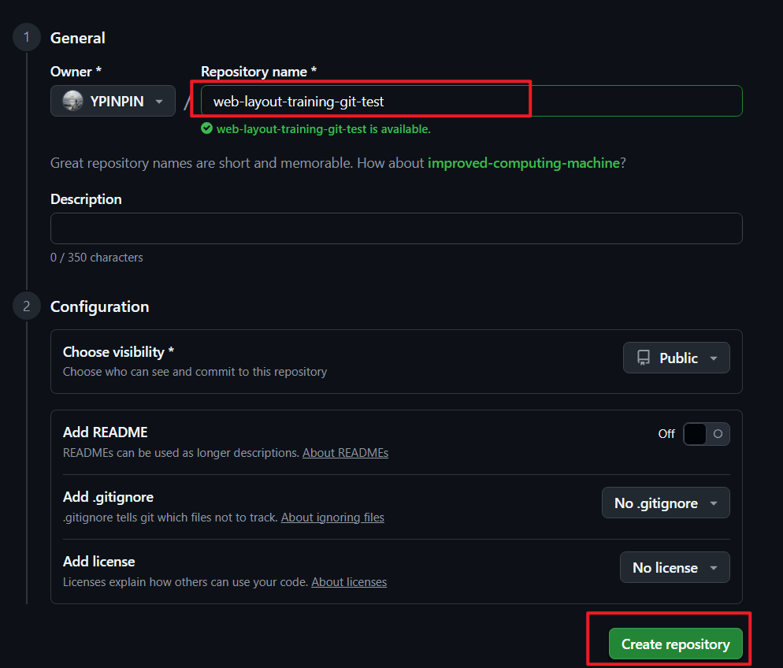
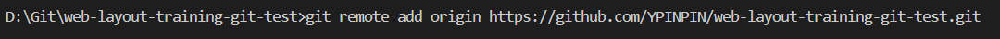
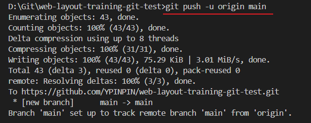
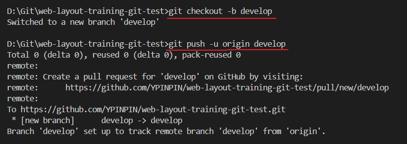
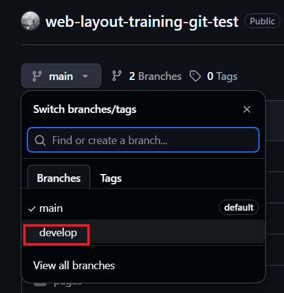
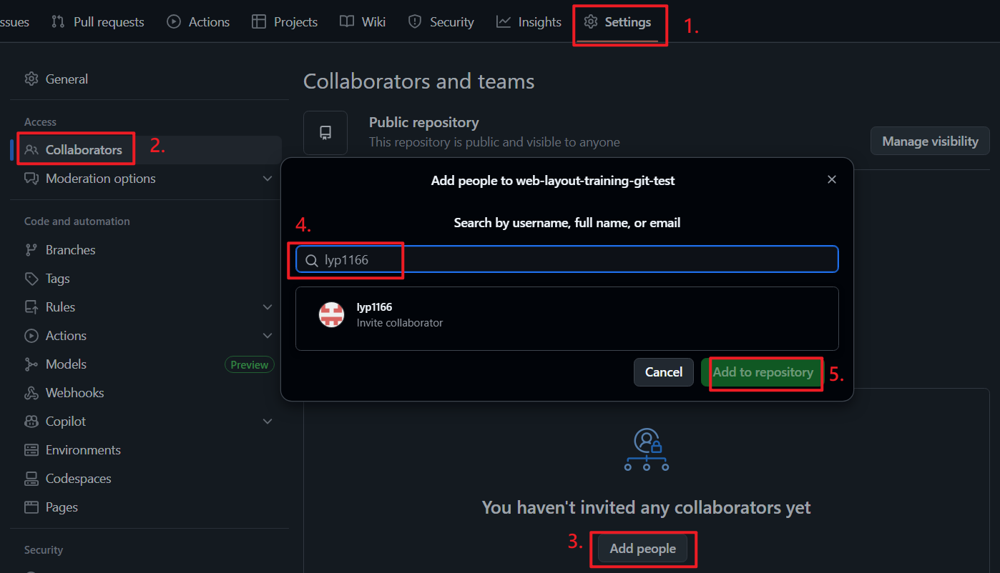
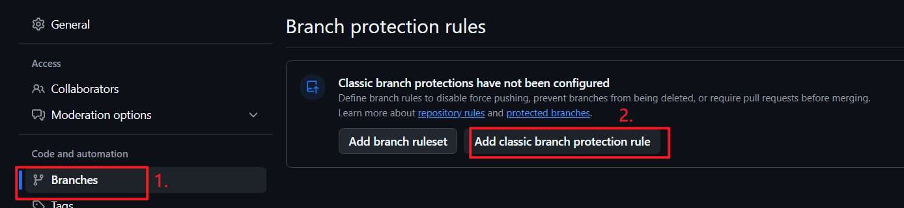
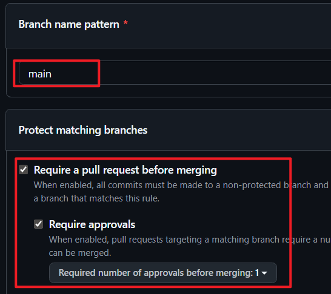
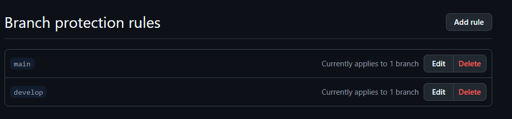

# GitHub 推送本地專案並開始協作操作說明

## 1. 在 GitHub 建立 Repository

1. 登入 GitHub，點選右上角「＋」>「New repository」。
2. 填寫儲存庫名稱，例如 `project-name`。
3. 選擇公開 (Public) 或私有 (Private)，根據團隊需求。
4. **不要勾選** 初始化 README、.gitignore 或 License（因為本地已有專案）。
5. 點擊「Create repository」建立空的遠端倉庫。



## 2. 將本地專案與遠端庫連結

打開終端機，切換至本地專案資料夾：

```bash
cd /path/to/your/local/project
```

設定遠端倉庫地址：

```bash
git remote add origin https://github.com/你的帳號/你的倉庫名稱.git
```



## 3. 推送本地 main 分支到 GitHub 遠端

```
git push -u origin main
```

> `-u` 會設定本地 main 分支追蹤遠端 main 分支，方便以後直接使用 `git push` 或 `git pull`。



## 4. 建立並推送 develop 分支作為日常開發主分支

```
git checkout -b develop
git push -u origin develop
```




## 5. GitHub 上設定協作者及分支保護建議

- 在專案網頁點「Settings」>「Manage access」，邀請團隊協作者。



- 被邀請的協作者，可以在自己的 Github 中同意邀請。


- 接著在「Settings」>「Branches」設定分支保護規則：

  - 禁止直接 push，要求透過 PR 合併，必須通過 1 人 Code Review。

  - 在 `main` 與 `develop` 分支都進行設置。







## 6. 開始團隊協作流程

- 所有人從 `develop` 分支切出功能分支開發。
- 功能完成推送功能分支並發起 PR 到 `develop`。
- 經過 Review、測試後合併 PR 到 `develop`。
- 定期由專案管理者將 `develop` 合併 PR 到 `main` 發布正式版本。

請參考 [GitHub flow 協作操作流程手冊](./GitHub_flow_協作操作流程手冊.md)。

---

_請依此流程操作，以確保團隊協作順利與版本管理清晰。_
